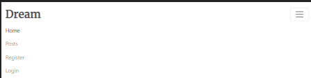
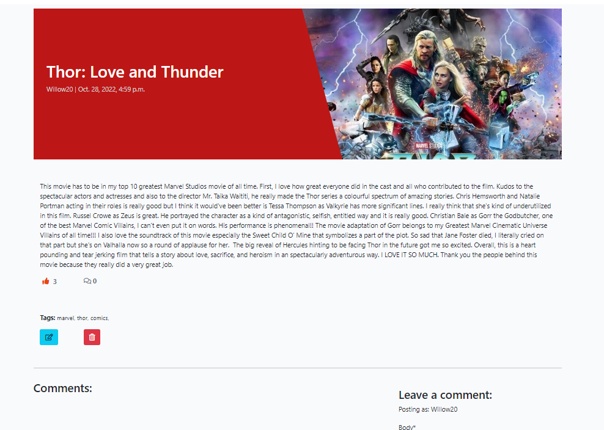

# Dream

## Film Blog
------------------------------------

Live site available [here](https://dreamblog23.herokuapp.com/).

-----

## Table of Contents
--------------------------------------

- [Description](#description)
- [Design](#design)
- [UX](#ux)
- [Agile Development](#agile-development)
- [Features](#features)
- [Testing](#testing)
- [Technologies](#technologies)
- [Deployment](#deployment)
- [Credits](#credits)
- [Acknowledgements](#acknowledgements)
- [Author Info](#author-info)

------

## Description
---------------------------------------

Dream is a website built in Django using Python, JavaScript, CSS/Bootstrap and HTML. It center around discussing all types of films. It enables users to read, discuss and like blog posts. It is targeted towards users who enjoy movies and would like to share their thoughts on different movies. Users have the ability to comment on posts and like them, once they register and login.

The site provides role based permissions for users to interact with a central dataset. It includes user authentication and full CRUD functionality for blog posts.

-------
## Design
-------

#### Wireframe free hand
---
Home page: 

The home page provides the user with a clear understanding as to the purpose of the site. The welcome message is clearly visable to the user when they first arrive at the site regardless of the device they are using.

Posts Page:

Users have the ability to create recipes to share with other users. The emphasis of the design is to provide a clear recipe layout that can adapt to any size device. Clearly seperating general information, ingredients and steps.
Users will have the ability to search for recipes based on a search query of their choice. To aid in the discovery of different recipes, each recipe will be displayed in the form of a summary card from which the user can access the full recipe details.

Wireframes were also produced for each major page for both mobile and tablet devices. With the intention of the site being fully responsive so that no matter the device size the user is viewing the site on, it will display accordingly.

* [Single-Recipe page wireframe](./docs/)
* [Profiles page wireframe](./docs/)
* [Inbox page wireframe](./docs/)
* [Message page wireframe](./docs/)
* [Form page wireframe](./docs/)
* [Delete page wireframe](./docs/)

[Back to the Top](#table-of-contents)
#### Database Schema
Several custom models were predicted to be required when building the site. In order for the users to comment on a post a custom comment model was required. The database schema was drawn out by hand.

Once I was happy with the overall structure of the site, and the layout of the wireframes, I selected the colour scheme. The colour scheme was checked for colour contrast to ensure that the appropriate colours were used for a high level of colour contrast to maximise accessibility for users.

[Back to the Top](#table-of-contents)

## UX
*  Dream Blog is inteded to be a site for users to go and read reviews of recent or past movies. Users will also be able to comment on posts and like them if they really enjoy it. The graphical elements and overall design of the site provide the user with a neat and straightforward environment.

### The Sites Ideal User
* Movie lover looking to share their thoughts on movies they've seen
* Someone looking to discuss films with like-minded people
* Someone looking for inspiration on what movie to see next

### Site Goals

* To provide users with a place to find movie reviews
* To provide users with a place to share their thoughts on movies
* To provide users with a place to find new movie ideas

[Back to the Top](#table-of-contents)

## Agile Development

The plan for this project was carried out using the Agile Methodology in Github. User Stories were created using issues on GitHub. Each user story explicitly explains the purpose of the issues. Each user story was prioritised using GitHub labels with different colors.

12 User Stories were created. The details on each user story can be found in the project kanban board [here](https://github.com/users/CWilson1993/projects/7)

Each story was assigned a classification of Must-Have, Should-Have, Could-Have or Won't Have.

### User Stories

Below are examples of some of the user stories completed for this project:

- User sign in or sign out
	*  User Account Login / Logout - As a User, I would like to be able to login or logout of my account, so that I can keep my account secure
	*  Restricted features to users logged in - As a Site Owner, I would like to restrict some features of the site to registered users, so that it encourages people to sign up to the site

- Home page
	*  As a User I would like to be brought to the home page upon first visiting the site so that I can see what options are available to me
    *  As a User from the home page I should have the option to view the Posts
    *  As a User on the home page I should be easily able to Log in or Register for an account

- Authorisation
	*  As the site developer I would like to restrict Post CRUD functionality to logged in Site Owners

- Post Interaction
	*  Leave Comments - As a User I can leave comments/feedback on Posts 
	*  Like posts - as a user I can like/unlike posts I read

[Back to the Top](#table-of-contents)

## Features

**Features planned:**
* Posts - Site Owners can create, read, update and delete their own posts.
* Blog posts - Users can read, comment and like blog posts.
* Users can login to their account.
* Users can logout of their account.
* Users need to be registered and logged in to access comment and like/unlike functionality.
* Responsive Design - the site needs to be fully responsive to cover the wide variety of devices users may use to access a recipe site.

#### Home page
A welcoming homepage was built to welcome the user to the site and clearly convey the sites purpose.

#### Navigation Bar
The main navigation bar appears at the top of the page, clearly displaying the main navigational links users would require.

A secondary user menu is available to users who are logged into the site.

A separate menu is available to site owners who are logged into the site.

#### Footer
A common footer is utilised throughout the site. It has the typical social links.

#### Blog Post Cards
The cards show the user the title of the post, the featured image of the post, brief description of the post and the author of the post. 
This allows the users to quickly identify the posts they would like to look at in more detail.

##### Standard Blog Post Card

#### Blog Post Detail
The post detail page shows several different elements including the content, number of likes, comments and also allows logged in users to comment.

#### Blog Post List
The post list page shows the blog posts on the site, it will show several posts and then allow users to move to the next page to view more.

## Future Enhancements
There are several items of functionality that I would like to add in the future.
The key areas I would like to add to the site in the future are:

* The ability for users to login via social networks such as google or facebook
* Forgot/reset password functionality
* Automatic emails when users sign up

[Back to the Top](#table-of-contents)

## Testing

### Testing Strategy
I used a manual testing strategy for the development of the site.
Separate to the functionality testing of the site, and the testing of the code, User Story tests were implemented to ensure that the criteria of the user stories listed above were met.

#### Testing Overview

Testing was divided into different sections to ensure everything was tested individually with test cases developed for each area.

#### Validator Testing
All code files were validated using suitable validators for the specific language.
HTML & CSS code passed the validation.
JavaScript code produced one warning about the use of an anonymous function within a loop.
When this function was named and moved outside the loop but referenced inside the loop, it broke functionality.
After attempting a few fixes I decided that an anonymous function inside a for loop was an acceptable JavaScript practice.
All validation screenshots are included below.

All HTML validation returned the same result so I have included only 1 screenshot here.

